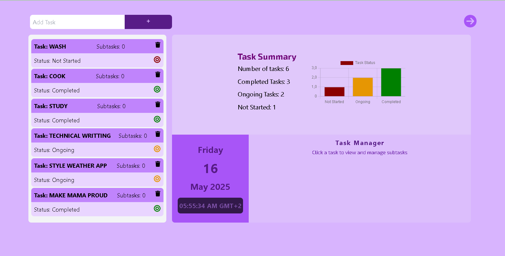

# 📝 My To-Do App (React + TailwindCSS)

A simple and responsive To-Do List application built with **React** and styled using **TailwindCSS**. It allows users to add, complete, and delete tasks and subtasks with persistent storage and a modern UI.

---

## 🚀 Live Demo

🔗 [View Live App](https://createexcutedelete.netlify.app/)

---

## 📸 Preview



---

## 🔧 Features

- ✅ Add tasks via input field
- ✅ Toggle task status between **Not Started**, **In Progress**, and **Completed**
- ✅ Delete tasks from the list
- ✅ Stores tasks in `localStorage` to persist data
- ✅ Visualize task data with chart.js
- ✅ Responsive UI using TailwindCSS
- ✅ Built with React functional components and hooks

---

## 🛠 Tech Stack

| Layer        | Tech              |
|--------------|-------------------|
| Frontend     | React ( CRA or Vite) |
| Styling      | TailwindCSS       |
| State        | React `useState`, `useEffect` |
| Storage      | `localStorage` API |
| Deployment   | Netlify |

---

## 📂 Project Structure

```bash
my-todo-app/
├── public/
│   └── preview.png         # App screenshot
├── src/
│   ├── components/         # React components (e.g., TodoItem, TodoList)
│   ├── App.jsx             # Main app logic
│   ├── index.jsx           # React entry point
│   └── index.css           # Tailwind styles
├── tailwind.config.js      # Tailwind configuration
├── package.json            # Project metadata
└── README.md               # Project documentation
```

## 🚀 Getting Started

Follow these steps to run the app locally.

**1. Clone the repository**
   
``` bash
git clone https://github.com/leonbadass/my-todo-app.git
cd my-todo-app
```

**2. Install Dependencies**

``` bash
npm install
```

**2. Start the development server**
If using Vite:

```bash
npm run dev
```
If using Create React App (CRA):

```bash
npm start
```
App will be available at:
🔗 http://localhost:3000 (CRA)
🔗 http://localhost:5173 (Vite)

## 🧠 What I Learned

**Building this project helped me:**
- Use React Hooks (useState, useEffect)
- Create clean and reusable components
- Style applications with TailwindCSS
- Persist app state using browser localStorage
- Present data using Chart.js
- Animate components using Framer Motion 
- Practice responsive layout and accessibility principles

## 📌 Planned Improvements

- [ ] Add task filters (All / Active / Completed)  
- [ ] Edit tasks inline  
- [ ] Drag-and-drop to reorder tasks  
- [ ] Add due dates and task priority labels  

---

## 🧪 Testing

_(To be added in future updates)_

- ✅ Manual testing for task behavior  
- 🔜 Plans to add React Testing Library + Vitest or Jest  

---

## 📄 License

This project is licensed under the **MIT License**.  
Feel free to fork, use, or modify it for your own learning.

---

## 👤 Author

**Leon Badass**  
📫 [GitHub](https://github.com/leonbadass)


